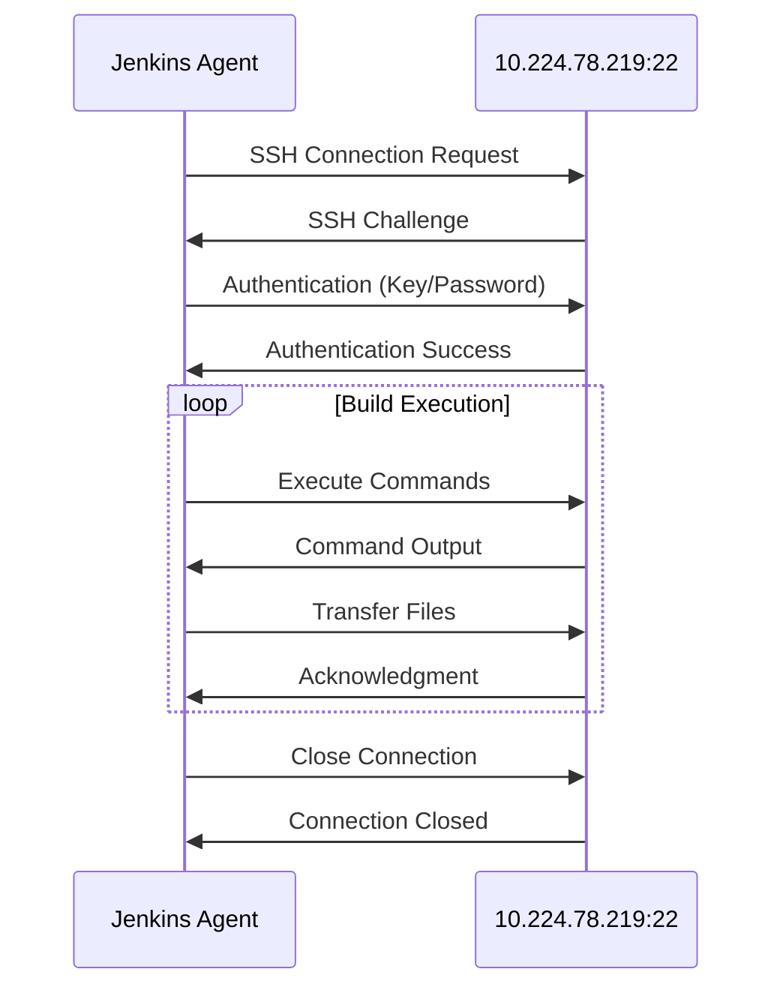

# Jenkins Agent SSH Connection Flow Diagram

## Connection Details

### Bidirectional Traffic Flow

**Outbound (Jenkins Agent → Target Server)**
- SSH connection establishment
- Command execution requests
- File transfers (SCP/SFTP)
- Build artifacts upload
- Job execution instructions

**Inbound (Target Server → Jenkins Agent)**
- SSH authentication responses
- Command execution results
- File transfers (SCP/SFTP)
- Build logs and output
- Status updates

### Connection Parameters
- **Target IP**: 10.224.78.219
- **Port**: 22 (SSH)
- **Protocol**: SSH (Secure Shell)
- **Traffic Direction**: Bidirectional

